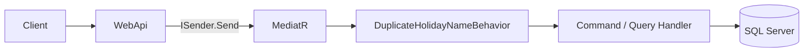

# MediatRUsages

[English](#english) | [Türkçe](#türkçe)

A .NET 10 Web API sample that shows how to use **MediatR** with **CQRS**, **pipeline behaviors**, and a layered architecture. The sample domain is a simple holiday (tatil) CRUD API.

---

## English

### Overview

This repository is a learning project for **MediatR** in ASP.NET Core. Controllers stay thin: they only send commands or queries through `ISender`. Business work lives in handlers, and cross-cutting rules (for example, unique holiday names) run in a MediatR **pipeline behavior** before the handler executes.

### What you will see

- **CQRS with MediatR** — create, update, and delete as commands; list and get-by-id as queries
- **Thin controllers** — `HolidaysController` dispatches requests, it does not contain business logic
- **Pipeline behavior** — `DuplicateHolidayNameBehavior` blocks duplicate holiday names on create and update
- **Marker interfaces** — `ICheckHolidayName` and `ICheckHolidayNameWithId` decide which requests enter the behavior
- **Layered architecture** — Web API, Application, Domain, Persistence
- **EF Core + SQL Server** — `Holiday` entity, `AppDbContext`, and an initial migration

### Tech stack

| Area | Choice |
| --- | --- |
| Runtime | .NET 10 |
| API | ASP.NET Core Web API, OpenAPI |
| Mediator | MediatR 14.2.0 |
| Data | Entity Framework Core 10, SQL Server |
| Solution | `MediatRUsages.slnx` |

### Architecture



| Layer | Project | Responsibility |
| --- | --- | --- |
| Presentation | `WebApi` | HTTP endpoints, DI, OpenAPI, connection string |
| Application | `ApplicationLayer` | Commands, queries, handlers, pipeline behaviors |
| Domain | `DomainLayer` | `Holiday` entity, `BaseEntity`, DTOs |
| Persistence | `PersistanceLayer` | `AppDbContext`, EF Core, migrations |

Dependency direction: **WebApi → Application → Persistence → Domain**.

### How MediatR is used

1. The controller sends a request:

```csharp
var holidayId = await _sender.Send(command);
```

2. Commands and queries implement `IRequest<TResponse>`. Example:

```csharp
public record CreateHolidayCommand(
    string Name,
    string Description,
    DateOnly StartDate,
    DateOnly EndDate)
    : IRequest<CreateHolidayResponse>, ICheckHolidayName;
```

3. Handlers implement `IRequestHandler<TRequest, TResponse>` and talk to `AppDbContext`.

4. `DuplicateHolidayNameBehavior<TRequest, TResponse>` is registered as an open pipeline behavior. It only runs for requests that implement `ICheckHolidayName`:
   - **Create** — rejects the request if the name already exists
   - **Update** — rejects the request if another holiday already uses the same name (`ICheckHolidayNameWithId`)

Registration lives in `ApplicationLayerRegistrar`:

```csharp
services.AddMediatR(cfg =>
{
    cfg.RegisterServicesFromAssembly(Assembly.GetExecutingAssembly());
    cfg.AddOpenBehavior(typeof(DuplicateHolidayNameBehavior<,>));
});
```

### Project structure

```text
MediatRUsages/
├── MediatRUsages.slnx
├── WebApi/
│   ├── Controllers/HolidaysController.cs
│   ├── Program.cs
│   └── appsettings.json
├── ApplicationLayer/
│   ├── ApplicationLayerRegistrar.cs
│   └── Features/Holidays/
│       ├── Commands/Create|Update|Delete
│       ├── Queries/GetHoliday|GetHolidayById
│       └── Rules/          # pipeline behavior + marker interfaces
├── DomainLayer/
│   ├── Entities/Holiday.cs
│   ├── Base/BaseEntity.cs
│   └── Dtos/HolidayListDto.cs
└── PersistanceLayer/
    ├── Context/AppDbContext.cs
    └── Migrations/
```

### Holiday model

| Field | Type | Notes |
| --- | --- | --- |
| `Id` | `Guid` | Primary key |
| `Name` | `string` | Must be unique (enforced in the pipeline) |
| `Description` | `string` | Create / list only |
| `StartDate` / `EndDate` | `DateOnly` | Holiday range |
| `IsDeleted`, `IsActive`, audit dates | inherited from `BaseEntity` | Present on the entity |

### API

Base URL (HTTP profile): `http://localhost:5080`

| Method | Path | Request | Result |
| --- | --- | --- | --- |
| `GET` | `/api/Holidays` | — | List of holidays |
| `GET` | `/api/Holidays/{id}` | — | Single holiday |
| `POST` | `/api/Holidays` | `CreateHolidayCommand` | `201 Created` |
| `PUT` | `/api/Holidays/{id}` | `UpdateHolidayCommand` | `201 Created` |
| `DELETE` | `/api/Holidays/{id}` | — | `204 No Content` |

Create body example:

```json
{
  "name": "Republic Day",
  "description": "National holiday",
  "startDate": "2026-10-29",
  "endDate": "2026-10-29"
}
```

Update body example:

```json
{
  "id": "00000000-0000-0000-0000-000000000001",
  "name": "Republic Day",
  "startDate": "2026-10-29",
  "endDate": "2026-10-29"
}
```

OpenAPI is mapped in Development at `/openapi/v1.json`.

### Getting started

**Requirements**

- [.NET 10 SDK](https://dotnet.microsoft.com/download)
- SQL Server (local instance or Docker)

**1. Clone and restore**

```bash
git clone https://github.com/<your-username>/MediatRUsages.git
cd MediatRUsages
dotnet restore MediatRUsages.slnx
```

**2. Connection string**

Edit `WebApi/appsettings.json`. The project expects a SQL Server connection named `SqlServer`:

```json
"ConnectionStrings": {
  "SqlServer": "Server=localhost,1433;Database=MediatRUsages;User Id=sa;Password=YourPassword;TrustServerCertificate=True;"
}
```

**3. Apply migrations**

```bash
dotnet ef database update --project PersistanceLayer --startup-project WebApi
```

**4. Run**

```bash
dotnet run --project WebApi
```

The HTTP profile listens on `http://localhost:5080`. HTTPS profile: `https://localhost:7042`.

### License

This repository is a personal / educational sample. Add a license file if you want to publish it under a specific license.

---

## Türkçe

### Genel bakış

Bu depo, ASP.NET Core içinde **MediatR** kullanımını göstermek için yazılmış bir öğrenme projesidir. Controller'lar ince tutulur: yalnızca `ISender` üzerinden komut veya sorgu gönderir. İş kuralları handler'lardadır. Ortak kurallar (örneğin tatil adının benzersiz olması) handler çalışmadan önce bir MediatR **pipeline behavior** içinde kontrol edilir. Örnek domain, basit bir tatil CRUD API'sidir.

### Göreceğiniz konular

- **MediatR ile CQRS** — oluşturma, güncelleme ve silme komut; listeleme ve id ile getirme sorgu
- **İnce controller** — `HolidaysController` isteği iletir, iş kuralı içermez
- **Pipeline behavior** — `DuplicateHolidayNameBehavior` oluşturma ve güncellemede aynı ismi engeller
- **İşaretleyici arayüzler** — `ICheckHolidayName` ve `ICheckHolidayNameWithId` behavior'ın hangi isteklere gireceğini belirler
- **Katmanlı mimari** — Web API, Application, Domain, Persistence
- **EF Core + SQL Server** — `Holiday` entity, `AppDbContext` ve ilk migration

### Teknolojiler

| Alan | Seçim |
| --- | --- |
| Runtime | .NET 10 |
| API | ASP.NET Core Web API, OpenAPI |
| Mediator | MediatR 14.2.0 |
| Veri | Entity Framework Core 10, SQL Server |
| Solution | `MediatRUsages.slnx` |

### Mimari


| Katman | Proje | Sorumluluk |
| --- | --- | --- |
| Presentation | `WebApi` | HTTP endpoint'leri, DI, OpenAPI, connection string |
| Application | `ApplicationLayer` | Komutlar, sorgular, handler'lar, pipeline behavior'lar |
| Domain | `DomainLayer` | `Holiday` entity, `BaseEntity`, DTO'lar |
| Persistence | `PersistanceLayer` | `AppDbContext`, EF Core, migration'lar |

Bağımlılık yönü: **WebApi → Application → Persistence → Domain**.

### MediatR nasıl kullanılıyor

1. Controller isteği gönderir:

```csharp
var holidayId = await _sender.Send(command);
```

2. Komut ve sorgular `IRequest<TResponse>` uygular. Örnek:

```csharp
public record CreateHolidayCommand(
    string Name,
    string Description,
    DateOnly StartDate,
    DateOnly EndDate)
    : IRequest<CreateHolidayResponse>, ICheckHolidayName;
```

3. Handler'lar `IRequestHandler<TRequest, TResponse>` uygular ve `AppDbContext` kullanır.

4. `DuplicateHolidayNameBehavior<TRequest, TResponse>` açık (open) pipeline behavior olarak kayıtlıdır. Yalnızca `ICheckHolidayName` uygulayan isteklerde çalışır:
   - **Create** — aynı isim varsa isteği reddeder
   - **Update** — aynı isim başka bir tatilde varsa isteği reddeder (`ICheckHolidayNameWithId`)

Kayıt `ApplicationLayerRegistrar` içindedir:

```csharp
services.AddMediatR(cfg =>
{
    cfg.RegisterServicesFromAssembly(Assembly.GetExecutingAssembly());
    cfg.AddOpenBehavior(typeof(DuplicateHolidayNameBehavior<,>));
});
```

### Proje yapısı

```text
MediatRUsages/
├── MediatRUsages.slnx
├── WebApi/
│   ├── Controllers/HolidaysController.cs
│   ├── Program.cs
│   └── appsettings.json
├── ApplicationLayer/
│   ├── ApplicationLayerRegistrar.cs
│   └── Features/Holidays/
│       ├── Commands/Create|Update|Delete
│       ├── Queries/GetHoliday|GetHolidayById
│       └── Rules/          # pipeline behavior + işaretleyici arayüzler
├── DomainLayer/
│   ├── Entities/Holiday.cs
│   ├── Base/BaseEntity.cs
│   └── Dtos/HolidayListDto.cs
└── PersistanceLayer/
    ├── Context/AppDbContext.cs
    └── Migrations/
```

### Tatil modeli

| Alan | Tip | Not |
| --- | --- | --- |
| `Id` | `Guid` | Birincil anahtar |
| `Name` | `string` | Benzersiz olmalı (pipeline'da kontrol edilir) |
| `Description` | `string` | Create / list |
| `StartDate` / `EndDate` | `DateOnly` | Tatil aralığı |
| `IsDeleted`, `IsActive`, denetim tarihleri | `BaseEntity`'den gelir | Entity üzerinde mevcut |

### API

HTTP profili temel adres: `http://localhost:5080`

| Metod | Yol | İstek | Sonuç |
| --- | --- | --- | --- |
| `GET` | `/api/Holidays` | — | Tatil listesi |
| `GET` | `/api/Holidays/{id}` | — | Tek tatil |
| `POST` | `/api/Holidays` | `CreateHolidayCommand` | `201 Created` |
| `PUT` | `/api/Holidays/{id}` | `UpdateHolidayCommand` | `201 Created` |
| `DELETE` | `/api/Holidays/{id}` | — | `204 No Content` |

Oluşturma gövdesi örneği:

```json
{
  "name": "Cumhuriyet Bayramı",
  "description": "Ulusal tatil",
  "startDate": "2026-10-29",
  "endDate": "2026-10-29"
}
```

Güncelleme gövdesi örneği:

```json
{
  "id": "00000000-0000-0000-0000-000000000001",
  "name": "Cumhuriyet Bayramı",
  "startDate": "2026-10-29",
  "endDate": "2026-10-29"
}
```

Development ortamında OpenAPI belgesi: `/openapi/v1.json`.

### Başlangıç

**Gereksinimler**

- [.NET 10 SDK](https://dotnet.microsoft.com/download)
- SQL Server (yerel instance veya Docker)

**1. Klonla ve restore et**

```bash
git clone https://github.com/<kullanici-adin>/MediatRUsages.git
cd MediatRUsages
dotnet restore MediatRUsages.slnx
```

**2. Connection string**

`WebApi/appsettings.json` dosyasındaki `SqlServer` bağlantısını kendi ortamına göre düzenle:

```json
"ConnectionStrings": {
  "SqlServer": "Server=localhost,1433;Database=MediatRUsages;User Id=sa;Password=YourPassword;TrustServerCertificate=True;"
}
```

**3. Migration uygula**

```bash
dotnet ef database update --project PersistanceLayer --startup-project WebApi
```

**4. Çalıştır**

```bash
dotnet run --project WebApi
```

HTTP profili: `http://localhost:5080`. HTTPS profili: `https://localhost:7042`.

### Lisans

Bu depo kişisel / eğitim amaçlı bir örnektir. Belirli bir lisansla yayınlamak istersen bir lisans dosyası ekleyebilirsin.
